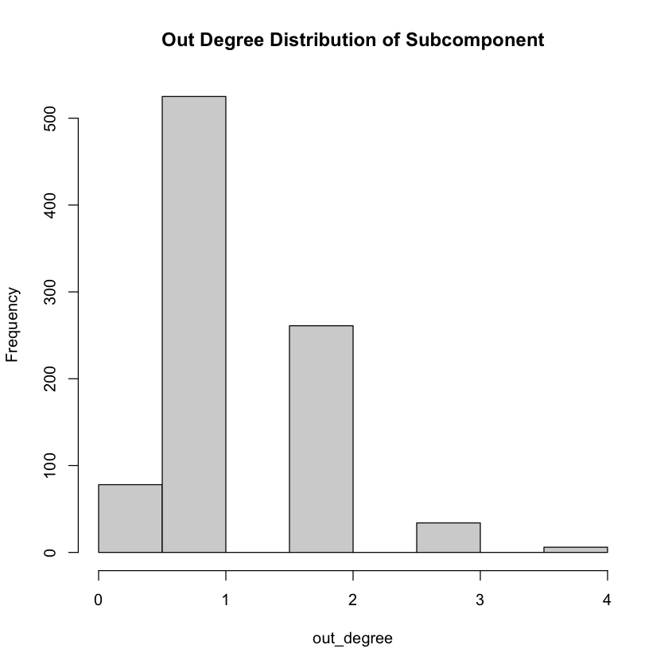

## Amazon Social Network Analysis


```R
library(dplyr)
library(igraph)
library(sqldf)
```

    
    Attaching package: ‘dplyr’
    
    
    The following objects are masked from ‘package:stats’:
    
        filter, lag
    
    
    The following objects are masked from ‘package:base’:
    
        intersect, setdiff, setequal, union
    
    
    
    Attaching package: ‘igraph’
    
    
    The following objects are masked from ‘package:dplyr’:
    
        as_data_frame, groups, union
    
    
    The following objects are masked from ‘package:stats’:
    
        decompose, spectrum
    
    
    The following object is masked from ‘package:base’:
    
        union
    
    
    Loading required package: gsubfn
    
    Loading required package: proto
    
    Warning message in doTryCatch(return(expr), name, parentenv, handler):
    “unable to load shared object '/Library/Frameworks/R.framework/Resources/modules//R_X11.so':
      dlopen(/Library/Frameworks/R.framework/Resources/modules//R_X11.so, 0x0006): Library not loaded: /opt/X11/lib/libSM.6.dylib
      Referenced from: /Library/Frameworks/R.framework/Versions/4.1-arm64/Resources/modules/R_X11.so
      Reason: tried: '/opt/X11/lib/libSM.6.dylib' (no such file), '/Library/Frameworks/R.framework/Resources/lib/libSM.6.dylib' (no such file), '/Library/Java/JavaVirtualMachines/zulu-8.jdk/Contents/Home/jre/lib/server/libSM.6.dylib' (no such file)”
    Could not load tcltk.  Will use slower R code instead.
    
    Loading required package: RSQLite
    


```R
#Read files
products <- read.csv('products.csv')
co_purchase <- read.csv('copurchase.csv')
```

### Data Description

The Products file, can be considered a metadata for all products on the database. Each product has its assosciated ID, Salesrank & Ratings.

The co_purchase file, documents the links between products. This would form the basis of the networks being created in subsequent questions.

### Data Cleaning

* Delete products that are not books from “products” and “copurchase” files. Note: In social network analysis, it important to define the boundary of your work; in other words, the boundary of the network.


```R
book_products <- products[products$group == "Book" & (products$salesrank<150000 & products$salesrank>-1), ]
book_id <- book_products$id
co_purchase_books <- co_purchase[co_purchase$Source %in% book_id & co_purchase$Target %in% book_id,]
```

After removing all instances that are not books and filtering for sales rank, total number of products = 35250 & co_purchase network = 22460

### Exploring books network

1. Create a variable named in-degree, to show how many “Source” products people who buy “Target” products buy; i.e. how many edges are to the focal product in “co-purchase” network.
2. Create a variable named out-degree, to show how many “Target” products people who buy “Source” product also buy; i.e., how many edges are from the focal product in “co-purchase” network.


```R
#In degree
graph <- graph.data.frame(co_purchase_books,directed=T)
# V(graph)
# E(graph)
indegree <- degree(graph,v = V(graph),mode = "in")
head(sort(indegree,decreasing = TRUE))
```


<style>
.dl-inline {width: auto; margin:0; padding: 0}
.dl-inline>dt, .dl-inline>dd {float: none; width: auto; display: inline-block}
.dl-inline>dt::after {content: ":\0020"; padding-right: .5ex}
.dl-inline>dt:not(:first-of-type) {padding-left: .5ex}
</style><dl class=dl-inline><dt>33</dt><dd>53</dd><dt>4429</dt><dd>52</dd><dt>244</dt><dd>36</dd><dt>302</dt><dd>22</dd><dt>5913</dt><dd>22</dd><dt>2501</dt><dd>20</dd></dl>


Product 33 has the highest indegree of 53, followed by Product 4429


```R
#Outdegree
outdegree <- degree(graph,v = V(graph),mode = "out")
head(sort(outdegree,decreasing = TRUE))
```


<style>
.dl-inline {width: auto; margin:0; padding: 0}
.dl-inline>dt, .dl-inline>dd {float: none; width: auto; display: inline-block}
.dl-inline>dt::after {content: ":\0020"; padding-right: .5ex}
.dl-inline>dt:not(:first-of-type) {padding-left: .5ex}
</style><dl class=dl-inline><dt>126396</dt><dd>5</dd><dt>151687</dt><dd>5</dd><dt>4993</dt><dd>4</dd><dt>26268</dt><dd>4</dd><dt>28040</dt><dd>4</dd><dt>29680</dt><dd>4</dd></dl>


Products 126396 & 151687 have the highest outdegree of 5

### Product 4429 - subcomponents i.e., all the products that are connected to this focal product. 


```R
#Total Degree
tot_degree <- degree(graph,v = V(graph),mode = "all")
which.max(tot_degree) 
head(sort(tot_degree,decreasing = TRUE))
prod_4429 <- subcomponent(graph,"4429",mode="all")
#prod_4429
```


<strong>4429:</strong> 308


<style>
.dl-inline {width: auto; margin:0; padding: 0}
.dl-inline>dt, .dl-inline>dd {float: none; width: auto; display: inline-block}
.dl-inline>dt::after {content: ":\0020"; padding-right: .5ex}
.dl-inline>dt:not(:first-of-type) {padding-left: .5ex}
</style><dl class=dl-inline><dt>4429</dt><dd>53</dd><dt>33</dt><dd>53</dd><dt>244</dt><dd>36</dd><dt>302</dt><dd>22</dd><dt>5913</dt><dd>22</dd><dt>2501</dt><dd>21</dd></dl>


Products 33 & 4429 have the highest total degree. For subcomponent analysis we select product 4429.


```R
sub_4429 <- induced_subgraph(graph, prod_4429)
V(sub_4429)$label <- V(sub_4429)$name 
V(sub_4429)$degree <- degree(sub_4429)
diameter(sub_4429, directed = T, weights = NA)
d <- get_diameter(sub_4429, weights = NULL)
d
```


9


    + 10/904 vertices, named, from 6f67878:
     [1] 37895 27936 21584 10889 11080 14111 4429  2501  3588  6676 


The diameter is 9 and the nodes along the diameter is 37895 27936 21584 10889 11080 14111 4429 2501 3588 6676. This means that the distance between two of the farthest nodes is 9.

### Visualization using Igraph


```R
plot(sub_4429,
     vertex.color=rainbow(52),
     edge.color='red',
     vertex.size= V(sub_4429)$degree*0.2,
     edge.arrow.size=0.2,
     vertex.label.cex=0.05,
     layout=layout.kamada.kawai)
```


    

    


From the visualization we can see that more products lied in the center and the centrality is relatively high


```R
in_degree <- degree(sub_4429, mode="in")
hist(indegree, main='In Degree Distribution of Subcomponent')
out_degree = degree(sub_4429, mode="out")
hist(out_degree, main='Out Degree Distribution of Subcomponent')

```


    

    


    

    


Visualizing both the indegree & outdegree graphs, we see that indegree is highly right skewed - meaning very few products flow into each other. Whereas Outdegree is more normally distributed, meaning there are some products that have relatively higher connections with other nodes

### Key Statistics


```R
#Density
ecount(sub_4429)/(vcount(sub_4429)*(vcount(sub_4429)-1))
# centrality
reciprocity(sub_4429)
#Closeness
closeness <- closeness(sub_4429, mode='all', weights=NA)
hist(closeness)
head(sort(closeness(sub_4429, mode='all', weights=NA), decreasing = TRUE))
#Betweenness
betweenness <- betweenness(sub_4429, directed='T', weights=NA)
hist(betweenness)
head(sort(betweenness(sub_4429, directed='T', weights=NA), decreasing = TRUE))
```


0.00143695057772028


0.286445012787724


<style>
.dl-inline {width: auto; margin:0; padding: 0}
.dl-inline>dt, .dl-inline>dd {float: none; width: auto; display: inline-block}
.dl-inline>dt::after {content: ":\0020"; padding-right: .5ex}
.dl-inline>dt:not(:first-of-type) {padding-left: .5ex}
</style><dl class=dl-inline><dt>33</dt><dd>0.000161238310222509</dd><dt>626</dt><dd>0.00015852885225111</dd><dt>242813</dt><dd>0.000157109190887667</dd><dt>4429</dt><dd>0.000155763239875389</dd><dt>224</dt><dd>0.000149611011370437</dd><dt>2558</dt><dd>0.000147885241052943</dd></dl>


    

    


<style>
.dl-inline {width: auto; margin:0; padding: 0}
.dl-inline>dt, .dl-inline>dd {float: none; width: auto; display: inline-block}
.dl-inline>dt::after {content: ":\0020"; padding-right: .5ex}
.dl-inline>dt:not(:first-of-type) {padding-left: .5ex}
</style><dl class=dl-inline><dt>2501</dt><dd>298</dd><dt>4429</dt><dd>260</dd><dt>3588</dt><dd>150</dd><dt>31513</dt><dd>92</dd><dt>30106</dt><dd>64</dd><dt>60266</dt><dd>62</dd></dl>


    

    


1. Density represents the ratio between edges & the maximum number of edges a graph can contain. Maximum number of edges = n*(n-1) where n is number of edges.In this network, density is 0.00143(0.143%), suggesting a very low density network. Low density suggests that this network has very little connections between the selected products


2. Reciprocity measures the response to a positive action with another positive action In this scenario, positive action could mean the buying of a product & the response to it would be buying another related product. In this network, reciprocity is 0.2864(28.64%)


3. Product 33 is the node, with highest closeness, and could form the center of this network representing shortest distance to all other nodes


4. Product 2501 - "The Narcissistic Family : Diagnosis and Treatment" has the highest betweenness score Suggests that this book acts as a bridge to other products in the network, and could be highly influential


```R
#Hub & Authority Score
hs1 <- hub.score(sub_4429)$vector
as1 <- authority.score(sub_4429)$vector
head(sort(hs1, decreasing = TRUE))
head(sort(as1, decreasing = TRUE))
```


<style>
.dl-inline {width: auto; margin:0; padding: 0}
.dl-inline>dt, .dl-inline>dd {float: none; width: auto; display: inline-block}
.dl-inline>dt::after {content: ":\0020"; padding-right: .5ex}
.dl-inline>dt:not(:first-of-type) {padding-left: .5ex}
</style><dl class=dl-inline><dt>195144</dt><dd>1</dd><dt>224</dt><dd>0.983684700869443</dd><dt>261899</dt><dd>0.980132637186229</dd><dt>212464</dt><dd>0.980132637186228</dd><dt>8715</dt><dd>0.980132637186227</dd><dt>39846</dt><dd>0.980132637186227</dd></dl>


<style>
.dl-inline {width: auto; margin:0; padding: 0}
.dl-inline>dt, .dl-inline>dd {float: none; width: auto; display: inline-block}
.dl-inline>dt::after {content: ":\0020"; padding-right: .5ex}
.dl-inline>dt:not(:first-of-type) {padding-left: .5ex}
</style><dl class=dl-inline><dt>33</dt><dd>1</dd><dt>193</dt><dd>0.0231751411836004</dd><dt>177720</dt><dd>0.0202700757632227</dd><dt>162324</dt><dd>0.0198753491674007</dd><dt>261898</dt><dd>0.0194804783944415</dd><dt>14623</dt><dd>0.0194804783944415</dd></dl>


1. The product with highest hub score is 195144, meaning it has connections with many other nodes in the given network In business context, this means that a lot of purchase is initiated through Product 195144 - "Paradise Found : Growing Tropicals in Your Own Backyard"


2. The authority of the network is product 33, meaning it this product has a lot of incoming edges In business context, this would mean that a lot of purchases eventually end up buying Product 33 - "Double Jeopardy"

### Poisson Regression

Create a group of variables containing the information of neighbors that “point to” focal products. The variables include:             
a.  Neighbors’ mean rating (nghb_mn_rating),                       
b.  Neighbors’ mean salesrank (nghb_mn_salesrank),                 
c.  Neighbors’ mean number of reviews (nghb_mn_review_cnt)


```R
nghb_mn_rating <-co_purchase_books %>%
        group_by(Target) %>%
        inner_join(book_products, by=c("Source"="id"))%>%
        transmute(nghb_mn_rating=mean(rating))
head(nghb_mn_rating)

nghb_mn_rank <- co_purchase_books %>%
        group_by(Target) %>%
        inner_join(book_products, by=c("Source"="id"))%>%
        transmute(nghb_mn_rank=mean(salesrank))
head(nghb_mn_rank)

nghb_mn_review_cnt<- co_purchase_books %>%
        group_by(Target) %>%
        inner_join(book_products, by=c("Source"="id"))%>%
        transmute(nghb_mn_review_cnt=mean(review_cnt))
head(nghb_mn_review_cnt)

mean <- co_purchase_books %>% 
        group_by(Target) %>% 
        inner_join(book_products, by=c("Source"="id")) %>%
        summarise(nghb_mn_rating=mean(rating),
                  nghb_mn_salesrank=mean(salesrank),
                  nghb_mn_review_cnt=mean(review_cnt))
```


<table class="dataframe">
<caption>A grouped_df: 6 × 2</caption>
<thead>
	<tr><th scope=col>Target</th><th scope=col>nghb_mn_rating</th></tr>
	<tr><th scope=col>&lt;int&gt;</th><th scope=col>&lt;dbl&gt;</th></tr>
</thead>
<tbody>
	<tr><td>261</td><td>4.500000</td></tr>
	<tr><td>282</td><td>4.000000</td></tr>
	<tr><td>422</td><td>4.000000</td></tr>
	<tr><td> 82</td><td>4.500000</td></tr>
	<tr><td>131</td><td>4.333333</td></tr>
	<tr><td>439</td><td>4.166667</td></tr>
</tbody>
</table>


<table class="dataframe">
<caption>A grouped_df: 6 × 2</caption>
<thead>
	<tr><th scope=col>Target</th><th scope=col>nghb_mn_rank</th></tr>
	<tr><th scope=col>&lt;int&gt;</th><th scope=col>&lt;dbl&gt;</th></tr>
</thead>
<tbody>
	<tr><td>261</td><td>24741.00</td></tr>
	<tr><td>282</td><td>27507.00</td></tr>
	<tr><td>422</td><td>43866.50</td></tr>
	<tr><td> 82</td><td>16689.00</td></tr>
	<tr><td>131</td><td>48533.00</td></tr>
	<tr><td>439</td><td>39930.67</td></tr>
</tbody>
</table>


<table class="dataframe">
<caption>A grouped_df: 6 × 2</caption>
<thead>
	<tr><th scope=col>Target</th><th scope=col>nghb_mn_review_cnt</th></tr>
	<tr><th scope=col>&lt;int&gt;</th><th scope=col>&lt;dbl&gt;</th></tr>
</thead>
<tbody>
	<tr><td>261</td><td>12.00000</td></tr>
	<tr><td>282</td><td> 2.00000</td></tr>
	<tr><td>422</td><td> 8.00000</td></tr>
	<tr><td> 82</td><td>10.00000</td></tr>
	<tr><td>131</td><td>19.33333</td></tr>
	<tr><td>439</td><td>21.33333</td></tr>
</tbody>
</table>


Variables Considered:
    1. review_cnt
    2. rating
    3. hub_score
    4. betweeness
    5. authority_score
    6. closeness
    7. in_degree
    8. out_degree
    9. nghb_mn_rating
    10. nghb_mn_salesrank
    11. nghb_mn_review_cnt 


```R
in_degree1 <- as.data.frame(in_degree)
in_degree1 <- cbind(newColName = rownames(in_degree1), in_degree1)
rownames(in_degree1) <- 1:nrow(in_degree1)
colnames(in_degree1) <- c("Nodes", "in_degree")

out_degree1 <- as.data.frame(out_degree)
out_degree1 <- cbind(newColName = rownames(out_degree1), out_degree1)
rownames(out_degree1) <- 1:nrow(out_degree1)
colnames(out_degree1) <- c("Nodes", "out_degree")

closeness1 <- as.data.frame(closeness)
closeness1 <- cbind(newColName = rownames(closeness1), closeness1)
rownames(closeness1) <- 1:nrow(closeness1)
colnames(closeness1) <- c("Nodes", "closeness")

betweeness1 <- as.data.frame(betweenness)
betweeness1 <- cbind(newColName = rownames(betweeness1), betweeness1)
rownames(betweeness1) <- 1:nrow(betweeness1)
colnames(betweeness1) <- c("Nodes", "betweeness")

hub_score2 <- as.data.frame(hs1)
hub_score2 <- cbind(newColName = rownames(hub_score2), hub_score2)
rownames(hub_score2) <- 1:nrow(hub_score2)
colnames(hub_score2) <- c("Nodes", "hub_score")

authority_score2 <- as.data.frame(as1)
authority_score2 <- cbind(newColName = rownames(authority_score2), authority_score2)
rownames(authority_score2) <- 1:nrow(authority_score2)
colnames(authority_score2) <- c("Nodes", "authority_score")


poisson_data <- sqldf("SELECT hub_score2.Nodes, hub_score, betweeness, 
        authority_score, closeness, in_degree, out_degree, nghb_mn_rating, 
        nghb_mn_salesrank, nghb_mn_review_cnt, products.id, products.review_cnt,
        products.rating, products.salesrank
        FROM hub_score2, betweeness1, authority_score2, closeness1, in_degree1,
        out_degree1, mean, products
        WHERE hub_score2.Nodes = betweeness1.Nodes 
        and hub_score2.Nodes = authority_score2.Nodes
        and hub_score2.Nodes = closeness1.Nodes
        and hub_score2.Nodes = in_degree1.Nodes
        and hub_score2.Nodes = out_degree1.Nodes
        and hub_score2.Nodes = mean.Target
        and hub_score2.Nodes = products.id")

str(poisson_data)

#run poisson regression
summary(salesrating_prediction<- glm(salesrank ~ review_cnt + rating + hub_score
        + betweeness + authority_score + closeness + in_degree + out_degree + 
        nghb_mn_rating+ nghb_mn_salesrank + nghb_mn_review_cnt, 
        family="poisson", data=poisson_data))
```

    'data.frame':	518 obs. of  14 variables:
     $ Nodes             : chr  "77" "130" "148" "187" ...
     $ hub_score         : num  3.51e-16 5.53e-04 3.59e-05 5.99e-04 6.63e-16 ...
     $ betweeness        : num  12 1 2 2 40 31 0 2 15 4 ...
     $ authority_score   : num  4.02e-17 2.44e-17 2.72e-17 2.43e-05 2.32e-02 ...
     $ closeness         : num  9.05e-05 1.08e-04 1.01e-04 1.08e-04 1.41e-04 ...
     $ in_degree         : num  3 1 1 3 10 2 2 3 2 4 ...
     $ out_degree        : num  1 1 1 3 1 2 3 3 2 1 ...
     $ nghb_mn_rating    : num  4.67 4.5 0 4.5 4.05 ...
     $ nghb_mn_salesrank : num  41744 19415 46701 133547 59471 ...
     $ nghb_mn_review_cnt: num  4 6 0 3.67 75.7 ...
     $ id                : int  77 130 148 187 193 224 321 322 422 556 ...
     $ review_cnt        : int  11 375 42 4 261 1 2 3 1 3 ...
     $ rating            : num  4.5 3.5 4 5 3 5 5 4.5 5 4 ...
     $ salesrank         : num  27012 29460 77008 17104 10350 ...


    
    Call:
    glm(formula = salesrank ~ review_cnt + rating + hub_score + betweeness + 
        authority_score + closeness + in_degree + out_degree + nghb_mn_rating + 
        nghb_mn_salesrank + nghb_mn_review_cnt, family = "poisson", 
        data = poisson_data)
    
    Deviance Residuals: 
        Min       1Q   Median       3Q      Max  
    -363.97  -159.78    -7.93   122.63   521.75  
    
    Coefficients:
                         Estimate Std. Error   z value Pr(>|z|)    
    (Intercept)         1.119e+01  1.108e-03 10094.147   <2e-16 ***
    review_cnt         -4.141e-03  4.651e-06  -890.240   <2e-16 ***
    rating             -6.999e-03  1.098e-04   -63.731   <2e-16 ***
    hub_score           2.447e-01  8.594e-04   284.761   <2e-16 ***
    betweeness         -7.528e-04  1.112e-05   -67.728   <2e-16 ***
    authority_score     1.814e-01  4.753e-03    38.167   <2e-16 ***
    closeness           1.927e+00  7.877e+00     0.245    0.807    
    in_degree           3.000e-03  6.816e-05    44.011   <2e-16 ***
    out_degree          5.838e-02  2.052e-04   284.480   <2e-16 ***
    nghb_mn_rating     -1.013e-02  1.252e-04   -80.892   <2e-16 ***
    nghb_mn_salesrank   2.258e-07  4.498e-09    50.200   <2e-16 ***
    nghb_mn_review_cnt  7.443e-04  1.967e-06   378.396   <2e-16 ***
    ---
    Signif. codes:  0 ‘***’ 0.001 ‘**’ 0.01 ‘*’ 0.05 ‘.’ 0.1 ‘ ’ 1
    
    (Dispersion parameter for poisson family taken to be 1)
    
        Null deviance: 16968896  on 517  degrees of freedom
    Residual deviance: 15337886  on 506  degrees of freedom
    AIC: 15344461
    
    Number of Fisher Scoring iterations: 5


### Interpretation

Interpreting Poisson Regression Coefficients Given that this is Poisson Distribution, the regression CF provides the log change of sales rank based on unit increase of dependent variable Intepretation below is done by taking exp() of CF of the regression output

1. review_cnt - Unit increase, would mean sales rank reduces by a factor of exp(-0.004) - 0.99 or 0.01% decrease

2. rating - Unit increase in rating, reduces sales rank by a factor of 0.99 - 0.01% decrease

3. hub_score - Unit increase in hub score, increases sales rank by a factor of 1.27 - 0.27% increase. This might mean the current hub is not beneficial in improving overall product sales

4. betweeness - Unit increase, decreases sales rank by 0.99 - 0.01% increase. Focus can be made on product - 2501 as it is a valuable bridge

5. Authority Score - Unit increase increases sales rank by a factor of 1.19 - 0.19% decrease.

6. Closeness - Unit increase, increases sales rank by a factor of 6.86 - 5.86% decrease

7. in_degree - Unit increase, increases sales rank by a factory of 1.003 - 0.003% increase

8. out_degree - Unit increase, increases sales rank by a factor of 1.06 - 0.06% increase

9. nghb_mn_rating - Unit increase, decreases sales rank by a factor of 0.98 - 0.02% increase

10. nghb_mn_review_cnt - Unit increase, increases sales rank by a factor of 1.0007 - 0.0007% increase


```R
#Experimenting with Log transformation, yields similar results
summary(salesrating_prediction<- glm(salesrank ~ log(review_cnt+1) + log(rating+1) + hub_score
        + log(betweeness+1) + authority_score + closeness + log(in_degree+1) + out_degree
        + nghb_mn_rating+ log(nghb_mn_salesrank+1) + log(nghb_mn_review_cnt+1), 
        family="poisson", data=poisson_data))
```


    
    Call:
    glm(formula = salesrank ~ log(review_cnt + 1) + log(rating + 
        1) + hub_score + log(betweeness + 1) + authority_score + 
        closeness + log(in_degree + 1) + out_degree + nghb_mn_rating + 
        log(nghb_mn_salesrank + 1) + log(nghb_mn_review_cnt + 1), 
        family = "poisson", data = poisson_data)
    
    Deviance Residuals: 
        Min       1Q   Median       3Q      Max  
    -333.38  -164.16   -19.26   125.78   400.68  
    
    Coefficients:
                                  Estimate Std. Error  z value Pr(>|z|)    
    (Intercept)                  1.097e+01  2.919e-03  3757.29   <2e-16 ***
    log(review_cnt + 1)         -1.708e-01  1.481e-04 -1153.25   <2e-16 ***
    log(rating + 1)              1.513e-01  3.450e-04   438.45   <2e-16 ***
    hub_score                    2.053e-01  8.583e-04   239.15   <2e-16 ***
    log(betweeness + 1)          1.221e-02  1.867e-04    65.42   <2e-16 ***
    authority_score              6.185e-01  3.546e-03   174.42   <2e-16 ***
    closeness                   -5.106e+02  7.956e+00   -64.17   <2e-16 ***
    log(in_degree + 1)          -1.235e-01  4.387e-04  -281.52   <2e-16 ***
    out_degree                   3.670e-02  2.308e-04   159.02   <2e-16 ***
    nghb_mn_rating              -2.601e-02  1.328e-04  -195.94   <2e-16 ***
    log(nghb_mn_salesrank + 1)   3.307e-02  2.373e-04   139.39   <2e-16 ***
    log(nghb_mn_review_cnt + 1)  6.233e-02  1.411e-04   441.74   <2e-16 ***
    ---
    Signif. codes:  0 ‘***’ 0.001 ‘**’ 0.01 ‘*’ 0.05 ‘.’ 0.1 ‘ ’ 1
    
    (Dispersion parameter for poisson family taken to be 1)
    
        Null deviance: 16968896  on 517  degrees of freedom
    Residual deviance: 14974110  on 506  degrees of freedom
    AIC: 14980685
    
    Number of Fisher Scoring iterations: 5


